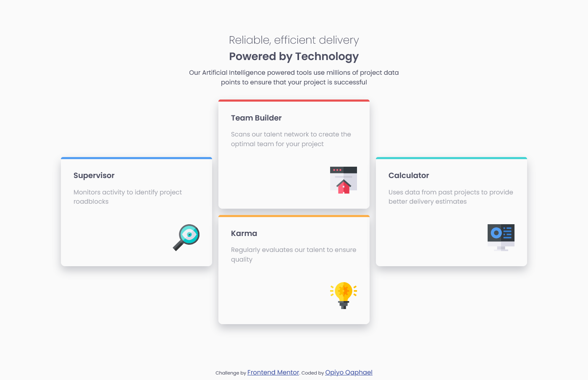
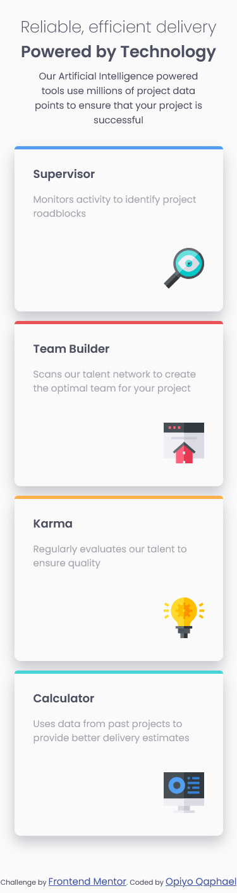

# Frontend Mentor - Four card feature section solution

This is a solution to the [Four card feature section challenge on Frontend Mentor](https://www.frontendmentor.io/challenges/four-card-feature-section-weK1eFYK). Frontend Mentor challenges help you improve your coding skills by building realistic projects.

## Table of contents

-   [Overview](#overview)
  - [The challenge](#the-challenge)
  - [Screenshot](#screenshot)
  - [Links](#links)
  - [Built with](#built-with)
  - [What I learned](#what-i-learned)
  - [Useful resources](#useful-resources)
  - [Author](#author)


## Overview
This is the front end mentor challenge recreation of Four card feature section solution I did following my other frontend mentor code challenges

### The challenge

Users should be able to:

- View the optimal layout for the interface depending on their device's screen size

### Screenshot




### Links

- Solution URL: [https://github.com/Qaphael/four-card-feature-section](https://github.com/Qaphael/four-card-feature-section)
- Live Site URL: [https://qaphael.github.io/four-card-feature-section/](https://qaphael.github.io/four-card-feature-section/)

## My process

### Built with

- Semantic HTML5 markup
- CSS custom properties
- Flexbox
- CSS Grid
- vscode

### What I learned

I learned and practiced a great deal of flex property in this challenge for positioning
I learnt a great deal of grid positioning from this project.

### Code I'm Proud of

```html
<h1>Some HTML code I'm proud of</h1>
<div class="col col-three">
  <span class="color-line"></span>
  <p class="content-heading">Calculator</p>
  <p class="content-body">
    Uses data from past projects to provide better delivery estimates
  </p>
  <div class="content-icon-box">
    
  </div>
</div>
```
```css
.proud-of-this-css {
  color: papayawhip;
}

.col:nth-child(1) .color-line {
  background-color: var(--Blue);
}
.col-two .col:nth-child(1) .color-line {
  background-color: var(--Red);
}
.col-two .col:nth-child(2) .color-line {
  background-color: var(--Orange);
}
.col:nth-child(3) .color-line {
  background-color: var(--Cyan);
}

```

### Useful resources

- [google fonts](https://fonts.google.com/) - This helped me for fonts i used in this challenge.

## Author

- Website - [Qaphael Opiyo](https://qaphael-portfolio-website.web.app/)
- Frontend Mentor - [@Qaphael](https://www.frontendmentor.io/profile/Qaphael)
- Twitter - [@lafo__lr](https://twitter.com/Laflo_lr)
- Github - [@Qaphael](https://github.com/Qaphael)

